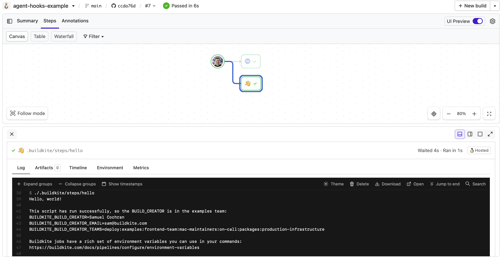
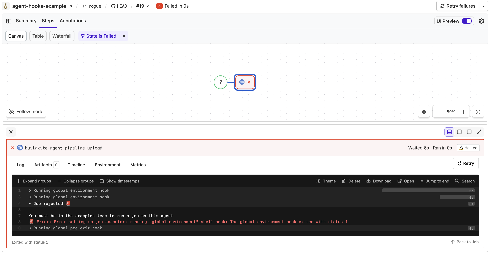

# Buildkite Agent Hooks Example

[](https://buildkite.com/buildkite/agent-hooks-example)
[](https://buildkite.com/new)

This repository demonstrates how to use [Buildkite Agent hooks](https://buildkite.com/docs/agent/v3/hooks) to control which teams may run pipelines on specific agents or groups of agents.

👉 **See these examples in action:**

- ✅ [Build with allowed team member](https://buildkite.com/buildkite/agent-hooks-example/builds/latest?branch=main)
- ❌ [Build rejected from unapproved user](https://buildkite.com/buildkite/agent-hooks-example/builds/latest?branch=rogue&state=failed)

See the full [Getting Started Guide](https://buildkite.com/docs/guides/getting-started) and [Buildkite Agent Overview](https://buildkite.com/docs/agent/v3) for step-by-step instructions on how to get this running, or try it yourself:

[](https://buildkite.com/new)

<a href="https://buildkite.com/buildkite/agent-hooks-example/builds/latest?branch=main">
  
</a>
<p align="left"><i>Allowed team member build succeeded</i></p>

<a href="https://buildkite.com/buildkite/agent-hooks-example/builds/latest?branch=rogue&state=failed">
  
</a>
<p align="left"><i>Unapproved team member build rejected by the hook</i></p>

---

<!-- docs:start -->

## How it works

Buildkite agents expose [environment variables](https://buildkite.com/docs/pipelines/configure/environment-variables#buildkite-environment-variables) about the jobs they run, and allow you to define [hooks](https://buildkite.com/docs/agent/v3/hooks) to customize job behavior.

This example uses the `environment` hook (located at [`agent/hooks/environment`](agent/hooks/environment)) to **restrict job execution based on team membership**.

The `environment` hook runs before code is checked out, making it ideal for early policy enforcement.

You can use this technique to:

- Restrict access to dedicated queues
- Enforce team-level separation on shared infrastructure
- Implement custom scheduling or resource constraints

---

## Setup

1. **Install the Agent Hook**

Install the `environment` hook on your agents:

  ```bash
    cp agent/hooks/environment /etc/buildkite-agent/hooks/environment
    chmod +x /etc/buildkite-agent/hooks/environment
  ```

  > 🛠️ If using [hosted agents](https://buildkite.com/docs/pipelines/hosted-agents), the hook can be preinstalled during agent setup.

2. **Use Dedicated Queues (Optional)**

If you're using this policy on only some agents, isolate them using [dedicated queue][queues] .

<!-- docs:end -->

## Related Documentation

**Agent and Hooks Overview**
- [Buildkite Agent Overview](https://buildkite.com/docs/agent/v3)
- [Agent Hooks](https://buildkite.com/docs/agent/v3/hooks)
  - [Job Lifecycle Hooks](https://buildkite.com/docs/agent/v3/hooks#job-lifecycle-hooks)
  - [Hooks Path](https://buildkite.com/docs/agent/v3/configuration#hooks-path)

**Environment and Permissions**
- [Environment Variables](https://buildkite.com/docs/pipelines/configure/environment-variables#buildkite-environment-variables)
- [Team Permissions and Programmatic Management](https://buildkite.com/docs/platform/team-management/permissions#manage-teams-and-permissions-programmatically-managing-teams)

**Agent Infrastructure**
- [Agent Queues](https://buildkite.com/docs/agent/v3/queues)
- [Hosted Agents](https://buildkite.com/docs/pipelines/hosted-agents)
  - [Agent Images Using Hooks](https://buildkite.com/docs/pipelines/hosted-agents/linux#agent-images-using-agent-hooks)
- [Elastic CI Stack for AWS](https://github.com/buildkite/elastic-ci-stack-for-aws)
  - [S3 Secrets Buckets for Agent Hooks](https://buildkite.com/docs/agent/v3/aws/elastic-ci-stack/ec2-linux-and-windows/secrets-bucket)

## License

See [LICENSE.md](LICENSE.md) (MIT)
